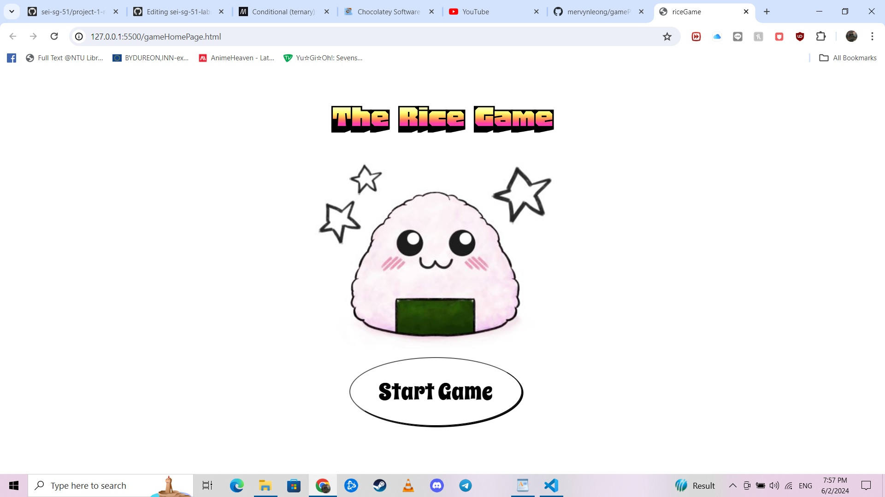
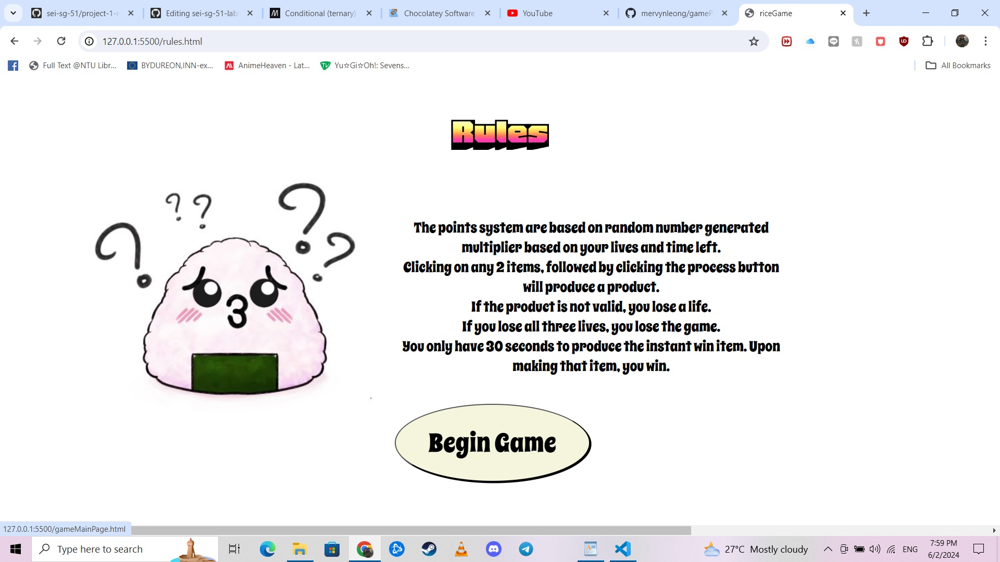
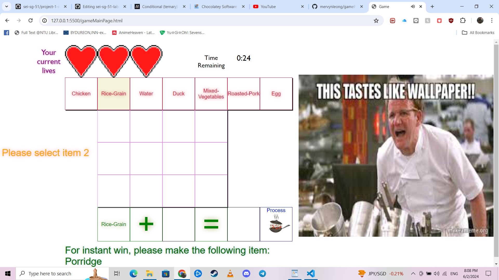
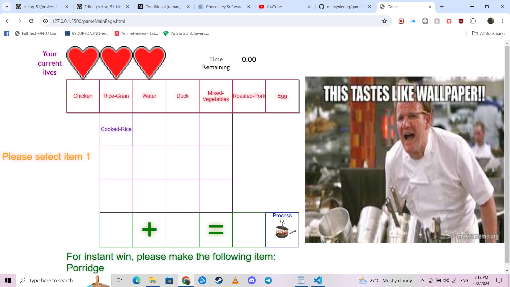
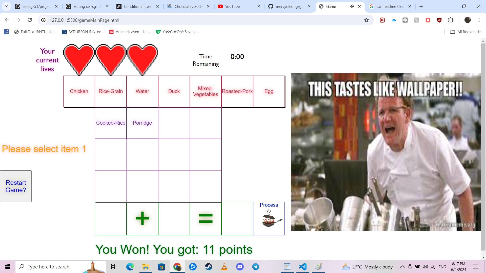
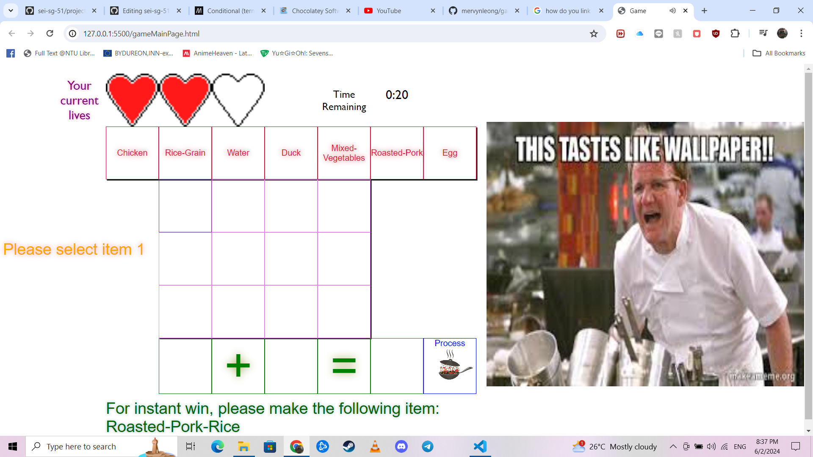
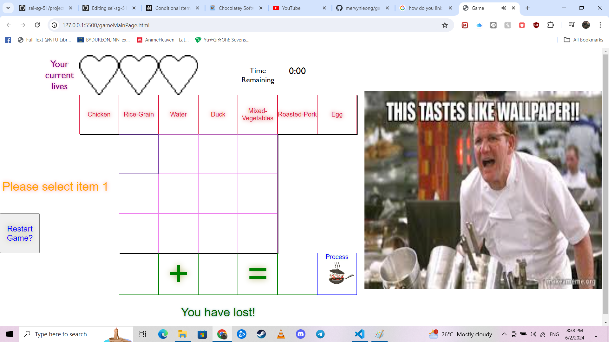

# gameProject1 for GA

Project of a "Doodle God" inspired game called "The Rice Game"
This game takes inspiration from "Doodle God's" elements' of selecting 2 items and dragging them to each other and produce a by-product.
Each by-product can mix with other by-products/ elements to be able to produce new by-products.
Doodle god may not have a win/lose condition as they only have a completion bar or checker per se.

Link to video of how "Doodle God" game is like below:
https://www.youtube.com/watch?v=noikl6ypI5c

However, The Rice Game has a win/lose condition.

Overview:
Opening the game leads the user to the html page showing the home screen:

The "Start Game" button: proceeds to bring user to another HTML to introduce the rules to the user below:

This page explains all the rules to the user needed to play the game.

Clicking on the "Begin Game" button will lead to the game interface HTML.

Game Interface:

Game guide:
THe top part of the screen displays the player's current lives. Each time a wrong combination of items are processed. The lives will be reduced by 1. The game is over when the player's life is reduced to zero.

Next to the life display is the "Time Remaining display". It gives the user the time remaining in the game. The time is only a feature to give points to the player when the player makes the correct item.

The points varies randomly depending on the time remaining and lives remaining.

Next is the 7 "Base" Items display. These 7 items are clickable. The first click will be immediately logged down below in the equation bar below. Once clicked, the item cannot be deleted or reverted.

After clicking, the player will be prompted to select item 2 as seen on the most left side of the screen. Once item 2 has been clicked, similarly, it will be logged into the equation bar and will prompt the user to process the item (by clicking on the "Process" Button below).

Once the "Process" button has been clicked, the game will check if the process is valid. If it is valid, the item will be made and logged into the center of the screen as shown below. These items are clickable as well to progress further into the processing stage to achieve the desired outcome.

If the player managed to make the appropriate item in the instant win hint box (Generated randomly) below, the game automatically ends and will log the points as shown below. There will also be a restart button that will refresh the page.

Losing lives/ the game:

If the process is invalid, the player will have life deducted as shown:

If all lives are lost, the player loses as shown in the hint box:

Others/ Miscellaneous:

Technologies used: HTML, Javascript (vanilla), CSS (vanilla).
Images and sound files are in the references below.
Planned improvements/ future enhancements of this game:

Drag and drop feature instead of clicking and "locking" in the items to process.
A reverse button to reverse the "logged" items.
A better library of "food" to process.
A better point system.
A better CSS styling.

Credits to the creator of the "Doodle God" game, JoyBits for this game concept inspiration.
Credits to General Assembly's Desmond and Gabrielle for the programming logic guide.

References to image/ sound sources
google fonts:
spicy rice:
https://fonts.google.com/specimen/Spicy+Rice?query=spicy+rice
honk:
https://fonts.google.com/specimen/Spicy+Rice?query=spicy+rice

gordon ramsay sound:
https://www.101soundboards.com/sounds/62244-you-donkey#goog_rewarded

pixel heart:
https://yousx.itch.io/pixel-heart?download

wok:
https://www.istockphoto.com/vector/cooking-process-on-pan-gm1215795154-354260268

winning sound/ click
https://mixkit.co/free-sound-effects/game/

onigiri:
https://misspraft.itch.io/onigiri-card
